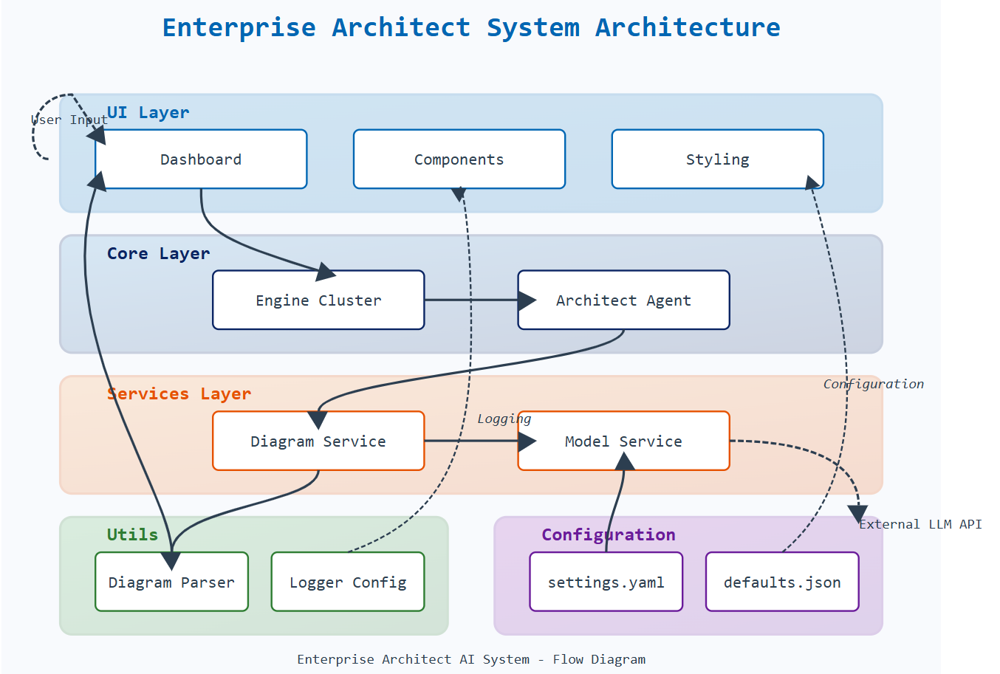

# Let's Build Solution Architect AI Agent

# Customer Support Ticket Evaluation AI Agent

Hands-On: Building Self-Sufficient AI Content Systems

## TL;DR
I created an AI system that automatically writes engaging tech blog posts by using three specialized AI agents working together — one analyzes writing styles, another researches trending topics, and a third creates the final content. The system uses CrewAI framework, OpenAI’s language models, and web scraping tools to produce customizable, high-quality content with minimal human intervention.

## Introduction:
Have you ever wished you could clone yourself to handle all the content creation tasks for your tech blog? That’s exactly what I set out to do, but instead of cloning myself, I built a team of specialized AI agents that work together to produce engaging tech content. The idea came to me after spending countless hours researching topics, analyzing successful writing styles, and crafting posts that would resonate with tech audiences. I thought: “There has to be a better way.” That’s when I decided to leverage AI to not just assist with content creation, but to handle the entire workflow from research to publication.

## What’s This Article About?
This article walks you through how I built a Tech Blogger AI system that creates high-quality tech blog posts without constant human supervision. The system uses three specialized AI agents, each with a different role: a Style Analyst that studies successful tech writing patterns, a Web Researcher that finds trending tech topics and gathers supporting data, and a Tech Influencer that combines these insights to write the final blog post.

These agents communicate and collaborate through a framework called CrewAI, passing their work outputs to each other to create a complete content creation pipeline. The system is highly configurable, letting you adjust everything from writing style preferences to content length to research focus areas without changing the underlying code. Throughout the article, I’ll explain the architecture decisions, code structure, and practical considerations that went into building this system.

Full Article : [https://medium.com/@learn-simplified/Lets-Build-Solution-Architect-AI-AgentAgent-be1b0d005232


## Tech Stack  


## Architecture




# Tutorial: Customer Support Ticket Evaluation AI Agent

## Prerequisites
- Python installed on your system.
- A basic understanding of virtual environments and command-line tools.

## Steps

1. **Virtual Environment Setup:**
   - Create a dedicated virtual environment for our project:
   
     ```bash
     python -m venv Lets-Build-Solution-Architect-AI-AgentAgent
     ```
   - Activate the environment:
   
     - Windows:
       ```bash
          Lets-Build-Solution-Architect-AI-AgentAgent\Scripts\activate        
       ```
     - Unix/macOS:
       ```bash
       source Lets-Build-Solution-Architect-AI-AgentAgent/bin/activate
       ```
   

# Installation and Setup Guide

**Install Project Dependencies:**

Follow these steps to set up and run the  "Customer Support Ticket Evaluation AI Agent"

1. Navigate to your project directory:
   ```
   cd path/to/your/project
   ```
   This ensures you're in the correct location for the subsequent steps.

2. Install the required dependencies:
   ```
   pip install -r requirements.txt   
   ```
   This command installs all the necessary Python packages listed in the requirements.txt file.


# Run - Hands-On Guide: Customer Support Ticket Evaluation AI Agent
  
   ```
   streamlit run ui/app.py   
   ```
   
## Closing Thoughts

The future of AI in business isn’t just about isolated tools handling specific tasks — it’s about creating intelligent systems where multiple AI agents collaborate to solve complex problems. As large language models continue to advance, we’ll see these multi-agent systems taking on increasingly sophisticated workflows across departments.

The next evolution will likely integrate real-time feedback systems, where AI content creators can automatically adjust their output based on audience engagement metrics. We might also see hybrid systems where human editors and AI agents work side-by-side, with the AI handling research and drafting while humans provide strategic direction and final polish.

The boundaries between human and AI-created content will continue to blur, raising important questions about disclosure, authenticity, and creative ownership. Businesses that experiment with these multi-agent systems now will be better positioned to navigate this rapidly evolving landscape and harness AI’s full potential for creative and knowledge work.
